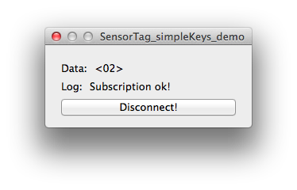

##SensorTag-simpleKeys-example

###Description

Simple OSX desktop app for reading TI SensorTag buttons. Uses CoreBluetooth framework.

You can find the details for *SensorTag* from <http://www.ti.com/tool/cc2541dk-sensor>

###Operation

* When user clicks to the connect button, application starts the scan and tries to connect to the first BLE peripheral it finds. 
* Checks wheter the peripheral's name is "SensorTag" or not and gives error message accordingly. 
* Later, tries to subscribe to the "Simple Key" characteristic's notifications and shows the raw value at the *Data* section.
